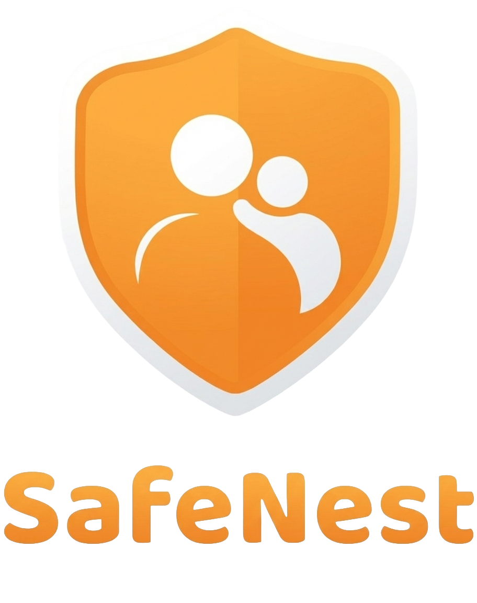

<p align="center">
  
</p>

<h1 align="center">Tuteliq Unity SDK</h1>

<p align="center">
  <strong>Official Unity SDK for the Tuteliq API</strong><br>
  AI-powered child safety analysis
</p>

<p align="center">
  <a href="https://github.com/Tuteliq/unity/actions"></a>
  <a href="https://github.com/Tuteliq/unity/blob/main/LICENSE.md"></a>
</p>

<p align="center">
  <a href="https://docs.tuteliq.ai">API Docs</a> •
  <a href="https://tuteliq.ai">Dashboard</a> •
  <a href="https://trust.tuteliq.ai">Trust</a> •
  <a href="https://discord.gg/7kbTeRYRXD">Discord</a>
</p>

---

## Installation

### Unity Package Manager (Git URL)

1. Open Window → Package Manager
2. Click "+" → "Add package from git URL..."
3. Enter: `https://github.com/Tuteliq/unity.git`
4. Click "Add"

### Manual Installation

1. Download the latest release
2. Extract to your `Packages/` folder

### Requirements

- Unity 2021.3+
- .NET Standard 2.1

---

## Quick Start

```csharp
using Tuteliq;
using UnityEngine;

public class Example : MonoBehaviour
{
    private TuteliqClient client;

    void Start()
    {
        client = new TuteliqClient("your-api-key");
        CheckMessage("Hello world");
    }

    async void CheckMessage(string message)
    {
        var result = await client.AnalyzeAsync(message);

        if (result.RiskLevel != RiskLevel.Safe)
        {
            Debug.Log($"Risk: {result.RiskLevel}");
            Debug.Log($"Summary: {result.Summary}");
        }
    }
}
```

---

## API Reference

### Initialization

```csharp
using Tuteliq;

// Simple
var client = new TuteliqClient("your-api-key");

// With options
var client = new TuteliqClient(
    apiKey: "your-api-key",
    timeout: 30f,        // Request timeout in seconds
    maxRetries: 3,       // Retry attempts
    retryDelay: 1f       // Initial retry delay in seconds
);
```

### Bullying Detection

```csharp
var result = await client.DetectBullyingAsync("Nobody likes you, just leave");

if (result.IsBullying)
{
    Debug.Log($"Severity: {result.Severity}");        // Medium
    Debug.Log($"Types: {result.BullyingType}");       // [exclusion, verbal_abuse]
    Debug.Log($"Confidence: {result.Confidence}");   // 0.92
    Debug.Log($"Rationale: {result.Rationale}");
}
```

### Grooming Detection

```csharp
var result = await client.DetectGroomingAsync(new DetectGroomingInput
{
    Messages = new List<GroomingMessage>
    {
        new GroomingMessage(MessageRole.Adult, "This is our secret"),
        new GroomingMessage(MessageRole.Child, "Ok I wont tell")
    },
    ChildAge = 12
});

if (result.GroomingRisk == GroomingRisk.High)
{
    Debug.Log($"Flags: {string.Join(", ", result.Flags)}");
}

// Per-message breakdown (optional, returned on conversation-aware endpoints)
if (result.MessageAnalysis != null)
{
    foreach (var m in result.MessageAnalysis)
        Debug.Log($"Message {m.MessageIndex}: risk={m.RiskScore}, flags={string.Join(", ", m.Flags)}, summary={m.Summary}");
}
```

### Unsafe Content Detection

```csharp
var result = await client.DetectUnsafeAsync("I dont want to be here anymore");

if (result.Unsafe)
{
    Debug.Log($"Categories: {string.Join(", ", result.Categories)}");
    Debug.Log($"Severity: {result.Severity}");
}
```

### Quick Analysis

Runs bullying and unsafe detection:

```csharp
var result = await client.AnalyzeAsync("Message to check");

Debug.Log($"Risk Level: {result.RiskLevel}");   // Safe/Low/Medium/High/Critical
Debug.Log($"Risk Score: {result.RiskScore}");   // 0.0 - 1.0
Debug.Log($"Summary: {result.Summary}");
Debug.Log($"Action: {result.RecommendedAction}");
```

### Emotion Analysis

```csharp
var result = await client.AnalyzeEmotionsAsync("Im so stressed about everything");

Debug.Log($"Emotions: {string.Join(", ", result.DominantEmotions)}");
Debug.Log($"Trend: {result.Trend}");
Debug.Log($"Followup: {result.RecommendedFollowup}");
```

### Action Plan

```csharp
var plan = await client.GetActionPlanAsync(new GetActionPlanInput
{
    Situation = "Someone is spreading rumors about me",
    ChildAge = 12,
    Audience = Audience.Child,
    Severity = Severity.Medium
});

Debug.Log($"Steps: {string.Join("\n", plan.Steps)}");
Debug.Log($"Tone: {plan.Tone}");
```

### Incident Report

```csharp
var report = await client.GenerateReportAsync(new GenerateReportInput
{
    Messages = new List<ReportMessage>
    {
        new ReportMessage("user1", "Threatening message"),
        new ReportMessage("child", "Please stop")
    },
    ChildAge = 14
});

Debug.Log($"Summary: {report.Summary}");
Debug.Log($"Risk: {report.RiskLevel}");
```

---

## Tracking Fields

All methods support `externalId` and `metadata` for correlating requests:

```csharp
var result = await client.DetectBullyingAsync(
    content: "Test message",
    externalId: "msg_12345",
    metadata: new Dictionary<string, object>
    {
        { "user_id", "usr_abc" },
        { "session", "sess_xyz" }
    }
);

// Echoed back in response
Debug.Log(result.ExternalId);  // msg_12345
Debug.Log(result.Metadata);    // {user_id: usr_abc, ...}
```

---

## Usage Tracking

```csharp
var result = await client.DetectBullyingAsync("test");

// Access usage stats after any request
if (client.Usage != null)
{
    Debug.Log($"Limit: {client.Usage.Limit}");
    Debug.Log($"Used: {client.Usage.Used}");
    Debug.Log($"Remaining: {client.Usage.Remaining}");
}

// Request metadata
Debug.Log($"Request ID: {client.LastRequestId}");

// Credits consumed per request
Debug.Log($"Credits Used: {result.CreditsUsed}");
```

### Credits

| Method | Credits |
|--------|---------|
| `DetectBullyingAsync()` | 1 |
| `DetectUnsafeAsync()` | 1 |
| `DetectGroomingAsync()` | 1 per 10 messages |
| `AnalyzeEmotionsAsync()` | 1 per 10 messages |
| `GetActionPlanAsync()` | 2 |
| `GenerateReportAsync()` | 3 |
| `AnalyzeVoiceAsync()` | 5 |
| `AnalyzeImageAsync()` | 3 |

Every result type includes a `CreditsUsed` field showing the credits consumed by that request.

---

## Error Handling

```csharp
using Tuteliq;

try
{
    var result = await client.DetectBullyingAsync("test");
}
catch (AuthenticationException e)
{
    Debug.LogError($"Auth error: {e.Message}");
}
catch (RateLimitException e)
{
    Debug.LogError($"Rate limited: {e.Message}");
}
catch (ValidationException e)
{
    Debug.LogError($"Invalid input: {e.Message}, details: {e.Details}");
}
catch (ServerException e)
{
    Debug.LogError($"Server error {e.StatusCode}: {e.Message}");
}
catch (TimeoutException e)
{
    Debug.LogError($"Timeout: {e.Message}");
}
catch (NetworkException e)
{
    Debug.LogError($"Network error: {e.Message}");
}
catch (TuteliqException e)
{
    Debug.LogError($"Error: {e.Message}");
}
```

---

## Chat Filter Example

```csharp
using Tuteliq;
using UnityEngine;
using UnityEngine.UI;

public class ChatFilter : MonoBehaviour
{
    [SerializeField] private InputField messageInput;
    [SerializeField] private Button sendButton;
    [SerializeField] private Text statusText;

    private TuteliqClient client;

    void Start()
    {
        client = new TuteliqClient("your-api-key");
        sendButton.onClick.AddListener(OnSendClicked);
    }

    async void OnSendClicked()
    {
        var message = messageInput.text;
        if (string.IsNullOrEmpty(message)) return;

        sendButton.interactable = false;
        statusText.text = "Checking...";

        try
        {
            var result = await client.AnalyzeAsync(message);

            if (result.RiskLevel == RiskLevel.Critical ||
                result.RiskLevel == RiskLevel.High)
            {
                statusText.text = $"Message blocked: {result.Summary}";
                return;
            }

            // Safe - send the message
            statusText.text = "Message sent!";
            messageInput.text = "";
            // SendToServer(message);
        }
        catch (TuteliqException e)
        {
            statusText.text = $"Error: {e.Message}";
        }
        finally
        {
            sendButton.interactable = true;
        }
    }
}
```

---

## Best Practices

### Message Batching

The **bullying** and **unsafe content** methods analyze a single `text` field per request. If your game receives messages one at a time (e.g., in-game chat), concatenate a **sliding window of recent messages** into one string before calling the API. Single words or short fragments lack context for accurate detection and can be exploited to bypass safety filters.

```csharp
// Bad — each message analyzed in isolation, easily evaded
foreach (var msg in messages)
{
    await client.DetectBullying(text: msg);
}

// Good — recent messages analyzed together
var window = string.Join(" ", recentMessages.TakeLast(10));
await client.DetectBullying(text: window);
```

The **grooming** method already accepts a `messages` array and analyzes the full conversation in context.

### PII Redaction

Enable `PII_REDACTION_ENABLED=true` on your Tuteliq API to automatically strip emails, phone numbers, URLs, social handles, IPs, and other PII from detection summaries and webhook payloads. The original text is still analyzed in full — only stored outputs are scrubbed.

---

## Support

- **API Docs**: [docs.tuteliq.ai](https://docs.tuteliq.ai)
- **Discord**: [discord.gg/7kbTeRYRXD](https://discord.gg/7kbTeRYRXD)
- **Email**: support@tuteliq.ai
- **Issues**: [GitHub Issues](https://github.com/Tuteliq/unity/issues)

---

## License

MIT License - see [LICENSE.md](LICENSE.md) for details.

---

## Get Certified — Free

Tuteliq offers a **free certification program** for anyone who wants to deepen their understanding of online child safety. Complete a track, pass the quiz, and earn your official Tuteliq certificate — verified and shareable.

**Three tracks available:**

| Track | Who it's for | Duration |
|-------|-------------|----------|
| **Parents & Caregivers** | Parents, guardians, grandparents, teachers, coaches | ~90 min |
| **Young People (10–16)** | Young people who want to learn to spot manipulation | ~60 min |
| **Companies & Platforms** | Product managers, trust & safety teams, CTOs, compliance officers | ~120 min |

**Start here →** [tuteliq.ai/certify](https://tuteliq.ai/certify)

- 100% Free — no login required
- Verifiable certificate on completion
- Covers grooming recognition, sextortion, cyberbullying, regulatory obligations (KOSA, EU DSA), and more

---

## The Mission: Why This Matters

Before you decide to contribute or sponsor, read these numbers. They are not projections. They are not estimates from a pitch deck. They are verified statistics from the University of Edinburgh, UNICEF, NCMEC, and Interpol.

- **302 million** children are victims of online sexual exploitation and abuse every year. That is **10 children every second**. *(Childlight / University of Edinburgh, 2024)*
- **1 in 8** children globally have been victims of non-consensual sexual imagery in the past year. *(Childlight, 2024)*
- **370 million** girls and women alive today experienced rape or sexual assault in childhood. An estimated **240–310 million** boys and men experienced the same. *(UNICEF, 2024)*
- **29.2 million** incidents of suspected child sexual exploitation were reported to NCMEC's CyberTipline in 2024 alone — containing **62.9 million files** (images, videos). *(NCMEC, 2025)*
- **546,000** reports of online enticement (adults grooming children) in 2024 — a **192% increase** from the year before. *(NCMEC, 2025)*
- **1,325% increase** in AI-generated child sexual abuse material reports between 2023 and 2024. The technology that should protect children is being weaponized against them. *(NCMEC, 2025)*
- **100 sextortion reports per day** to NCMEC. Since 2021, at least **36 teenage boys** have taken their own lives because they were victimized by sextortion. *(NCMEC, 2025)*
- **84%** of reports resolve outside the United States. This is not an American problem. This is a **global emergency**. *(NCMEC, 2025)*

End-to-end encryption is making platforms blind. In 2024, platforms reported **7 million fewer incidents** than the year before — not because abuse stopped, but because they can no longer see it. The tools that catch known images are failing. The systems that rely on human moderators are overwhelmed. The technology to detect behavior — grooming patterns, escalation, manipulation — in real-time text conversations **exists right now**. It is running at [api.tuteliq.ai](https://api.tuteliq.ai).

The question is not whether this technology is possible. The question is whether we build the company to put it everywhere it needs to be.

**Every second we wait, another child is harmed.**

We have the technology. We need the support.

If this mission matters to you, consider [sponsoring our open-source work](https://github.com/sponsors/Tuteliq) so we can keep building the tools that protect children — and keep them free and accessible for everyone.

---

<p align="center">
  <sub>Built with care for child safety by the <a href="https://tuteliq.ai">Tuteliq</a> team</sub>
</p>
